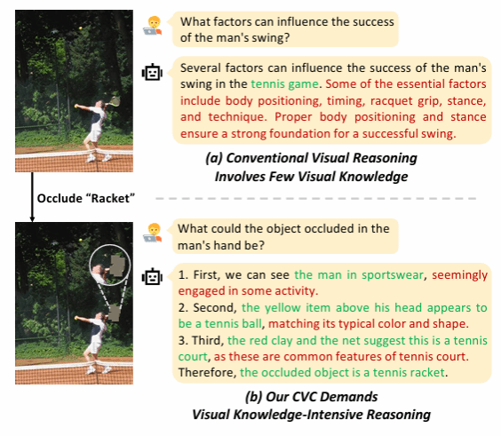

&emsp;&emsp;IJCAI会议（International Joint Conference on Artificial Intelligence，国际人工智能联合会议）是人工智能领域最具历史和学术声望的国际会议之一，在CCF学术推荐列表中认定为A类会议。IJCAI 2025将于2025年8月在加拿大蒙特利尔举办。
<!--more-->

- - - 
- 论文标题：Boosting Visual Knowledge-Intensive Training for LVLMs through Causality-driven Visual Object Completion
- 录用类型：IJCAI2025
- 论文作者：Qingguo Hu+, Ante Wang+, Jia Song, Delai Qiu, Qingsong Liu, Jinsong Su\*
- 完成单位：厦门大学，云知声

- 论文简介：
本研究提出了一种创新的自我改进框架，用于增强视觉语言模型（LVLMs）的视觉感知与推理能力。该框架基于因果驱动的视觉对象补全任务（CVC），要求以明确的推理链形式，利用图像中的可见上下文信息来推断被遮挡的对象，从而将感知密集的复杂推理能力引入LVLMs。类似于人类通过反复试错来提升解决复杂问题的能力，该框架采用试错学习来强化LVLM对CVC的掌握程度，从而提升其全面的视觉能力。首先，该框架采样LVLM的多个推理路径（试验），然后挑选出对训练有价值的样本，最终将这些自我生成的试验用于LVLM的自我改进。因此，LVLM的视觉能力可以在不依赖人类或更先进 LVLM 的情况下得到全面的自我提升。实验证明，该框架在多个通用测试基准和高难度专项任务上均优于对应的基线模型，尤其在更具挑战性的任务中，如MMVP和Winoground，分别实现了10.0%和8.2%的提升。