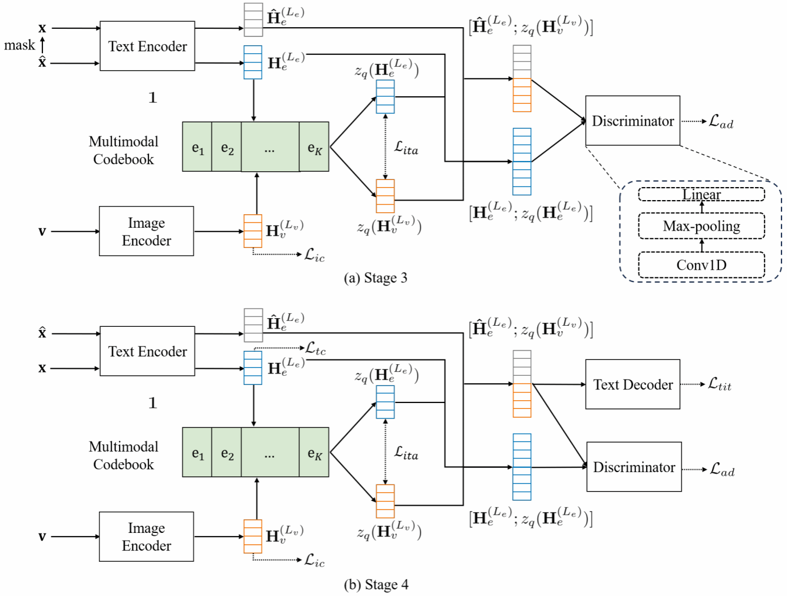

&emsp;&emsp;Neural Networks是国际著名的学术期刊，专注于神经网络及深度学习领域的前沿研究，在CCF学术推荐列表中认定为B类期刊。
<!--more-->

- - - 
- 论文标题：Towards Better Text Image Machine Translation with Multimodal Codebook and Multi-stage Training
- 录用类型：Neural Networks
- 论文作者：Zhibin Lan, Jiawei Yu, Shiyu Liu, Junfeng Yao, Degen Huang, Jinsong Su\*
- 完成单位：厦门大学，大连理工大学

- 论文简介：
当前图文翻译任务在跨模态理解与语言生成领域受到广泛关注，但现有方法仍面临两大核心挑战：一方面，主流方法普遍采用OCR识别与文本翻译串联的级联结构，导致OCR误识别会严重影响最终翻译结果；另一方面，缺乏大规模、高质量的公开图文翻译数据集也限制了模型能力的进一步提升。为此，本研究人工标注并公开了首个中英图文翻译数据集OCRMT30K，并借助自动翻译工具将其扩展到中德语言对上，为该领域提供了宝贵的训练资源与评测基准。此外，本研究提出了一种基于多模态码本的图文翻译模型，通过引入图像编码器、文本编码器、文本解码器以及可桥接图文语义的多模态代码本，实现了跨模态语义的高效对齐与增强的翻译性能。同时，论文设计了一套多阶段训练框架，充分利用不同类型的数据资源，逐步优化各个模块：先基于双语文本进行文本模块的预训练，接着引入基于码元的掩码翻译任务进一步训练多模态码本与文本编码器和解码器模块，再借助图文对齐与对抗训练方法在OCR数据集上优化图像编码器模块与多模态码本，最后使用图文翻译数据集对整个模型进行微调。实验结果表明，该模型在中英与中德图文翻译任务中均显著优于现有方法，验证了其跨模态建模与阶段训练策略的有效性。