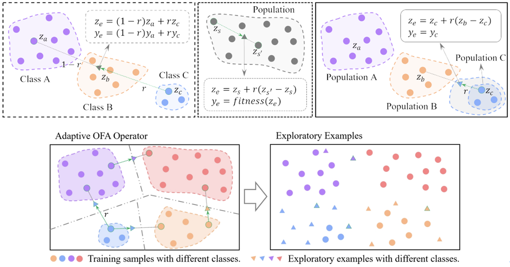

&emsp;&emsp;ICCV会议（International Conference on Computer Vision，计算机视觉国际大会），是是计算机视觉领域的全球顶级学术会议之一，在CCF学术推荐列表中认定为A类会议。ICCV2025 将于2025年10月19日至23日在夏威夷檀香山举行。
<!--more-->

- - - 
- 论文标题：Supervised Exploratory Learning for Long-Tailed Visual Recognition
- 录用类型：ICCV2025 主会长文
- 论文作者：Zhongquan Jian+, Yanhao Chen+, Yancheng Wang, Junfeng Yao\*, Meihong Wang\*, Qingqiang Wu\*
- 完成单位：厦门大学

- 论文简介：
长尾数据对深度学习模型提出了重大挑战，这些模型往往倾向于优先保证头部类别的分类准确性，而严重忽略尾部类别。现有技术（如类别重平衡、逻辑调整和数据增强）主要致力于扩大尾部类别的决策区域或实现清晰的决策边界，却忽视了决策区域的鲁棒性。本文提出了一种简单而有效的监督式探索学习框架（SEL），从空间探索的角度同时实现上述目标。SEL采用自适应最优觅食算法（OFA）生成多样化的探索样本，并结合类别偏置补偿（CbC）实现类别分布平衡，以及适应度加权采样（FwS）进行空间探索。理论分析和实验结果均表明，SEL能够提升类别平衡性、锐化决策边界并强化决策区域。SEL是一种即插即用的训练框架，可无缝集成到模型训练或分类器调整阶段，具有高度适应性和兼容性，能够与现有方法结合并进一步提升性能。在多个长尾基准数据集上的大量实验证明了SEL的优越性。